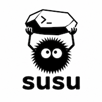

<p align="center">
  
</p>

# susu

[](https://github.com/exdial/susu/actions/workflows/ci.yml)
[](https://github.com/exdial/susu/releases)
[](LICENSE)

`susu` is a small Unix CLI for keeping selected dotfiles in a Git repository and restoring them on another machine. Public files are stored as ordinary snapshots; files added with `--sensitive` are encrypted before they enter the repository.

`susu` supports macOS and Linux. It manages dotfile entries and their contents, while Git remains responsible for commits, remotes, synchronization, merges, and history.

## Features

- Store individual files or recursively add directories.
- Encrypt sensitive files with one password per repository.
- Share portable HOME and XDG config paths across machines.
- Exclude entries explicitly on macOS or Linux.
- Inspect stored files and restore them with predictable one-way commands.

## Installation

Prebuilt archives are published on the [GitHub Releases](https://github.com/exdial/susu/releases) page for:

- Linux (`amd64`, `arm64`);
- macOS / Darwin (`amd64`, `arm64`).

Every release includes `checksums.txt` for artifact verification. All binaries are packaged as `.tar.gz` archives with `README.md`, `LICENSE`, and `CHANGELOG.md`.

To install from source, Go 1.26 is required. From the repository root, install with the pinned mise toolchain:

```bash
mise install
mise exec -- make install
```

Or use an already installed compatible Go toolchain:

```bash
make install
```

`make install` writes `susu` to `GOBIN` or the standard Go binary directory. Ensure that directory is on `PATH`. Run `make` instead to build `./susu` without installing it.

## Quick start

Create and select a Git repository, then add the files you want to manage:

```bash
mkdir -p "$HOME/src"
git init "$HOME/src/dotfiles"

susu init "$HOME/src/dotfiles"
susu add "$HOME/.zshrc" "$HOME/.gitconfig"
susu add --exclude-platform linux "$HOME/.hammerspoon/init.lua"
susu add --sensitive "$HOME/.kube/config"

susu list

git -C "$HOME/src/dotfiles" add susu.json public encrypted
git -C "$HOME/src/dotfiles" commit -m "Manage dotfiles with susu"
```

The first sensitive operation asks for a repository password and confirmation. The password is never stored.

On another machine, use Git to retrieve the repository and `susu` to restore its files:

```bash
git clone <repository-url> "$HOME/src/dotfiles"
susu init "$HOME/src/dotfiles"
susu list
susu apply
```

> `susu apply` replaces applicable managed destination files. Review `susu list` and the repository before applying; `susu` does not create backups or resolve conflicts.

## Commands

| Command | Purpose |
| --- | --- |
| `susu init <repository>` | Select and initialize an existing Git repository root |
| `susu add [options] <path...>` | Start managing files or directories |
| `susu rm <path...>` | Stop managing files without deleting local destinations |
| `susu list` | List managed portable paths |
| `susu show <path>` | Print one stored file to stdout |
| `susu apply` | Restore applicable files to local destinations |

`add` captures a file only when it first becomes managed; it does not synchronize entries that already exist. Sensitive classification and platform exclusions are always explicit. The machine-local `susu` state directory, active repository worktree, and Git common administrative directory are reserved control roots: `add` rejects inputs that overlap or contain them, and `apply` refuses applicable manifest destinations that would overlap them.

## A little lore

`susu` comes from the Japanese word `susu` (すす), meaning “soot”, and is a nod to the Susuwatari, the tiny soot sprites from Hayao Miyazaki's worlds.

It is pronounced roughly `su-su`: two short, even syllables, without a strong English-style stress.

Susuwatari are small, quiet creatures that live around the house, carrying little things and doing their work mostly out of sight.

That felt appropriate for a small Unix-style tool whose job is to take care of the little configuration files living around your `$HOME`.

`susu` does not try to manage your entire system. It tracks an explicit set of dotfiles, stores their snapshots in a repository, restores them to your home directory, and stays out of the way.

Small files. Small tool. One job.

## Documentation

- [Reference](docs/reference.md) — detailed commands, path behavior, repository format, workflows, and limitations.
- [Encryption and security model](docs/security-model.md) — encryption design, threat model, operational guidance, and audit status.
- [Design and architecture](docs/design.md) — components, data flow, locking, and filesystem guarantees.
- [Changelog](CHANGELOG.md) — version-specific changes.
- [Releasing](docs/releasing.md) — maintainer workflow and published artifact matrix.

## License

`susu` is available under the [MIT License](LICENSE).
