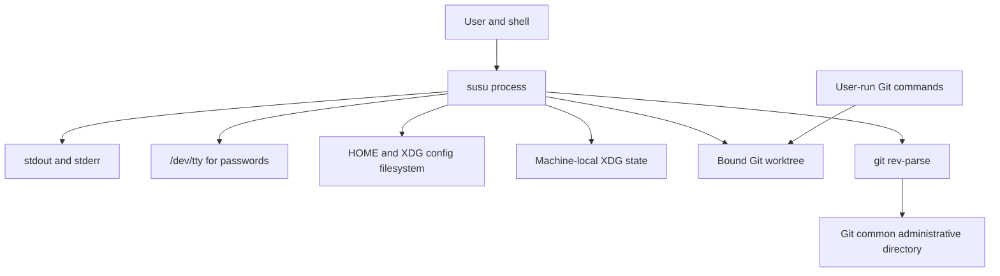
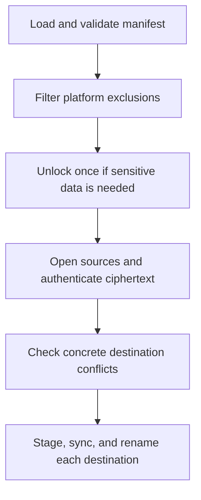

# Design and architecture

`susu` is a one-shot Unix CLI that captures selected files in an existing Git worktree and restores those snapshots into a user's home or XDG config directory. Public entries are stored as ordinary files; entries explicitly marked sensitive are stored as authenticated ciphertext.

The implemented command model has explicit data directions:

| Command | Responsibility | Data direction |
| --- | --- | --- |
| `init <repository>` | Initialize and bind an existing Git worktree root | repository path → local binding |
| `add [options] <path...>` | Start managing files | filesystem → repository |
| `rm <path...>` | Stop managing exact files | manifest and repository storage deletion |
| `list` | Inspect managed membership | manifest → stdout |
| `show <path>` | Emit one stored snapshot | repository → stdout |
| `apply` | Restore applicable snapshots | repository → filesystem |

`add` captures content only when an entry first becomes managed. Repeating it for an existing entry does not refresh the repository snapshot. There is no background service, key cache, repository auto-discovery, or command that reconciles local and stored changes.

## System context

Each invocation constructs its configuration from `HOME`, `XDG_CONFIG_HOME`, `XDG_STATE_HOME`, the initial working directory, and Go's `runtime.GOOS`. It then performs one command and exits. Git subprocesses additionally inherit the process environment.



The supported operating-system values are `darwin` and `linux`. The filesystem confinement layer is implemented only for those platforms.

`git` is a runtime dependency for repository validation and locating the common Git administrative directory. The executable is resolved through `PATH`, and Git-related variables such as `GIT_DIR`, `GIT_WORK_TREE`, and `GIT_COMMON_DIR` are not sanitized; they can change Git's interpretation of the worktree or administrative directory. Exact-root validation and lock placement therefore assume a trusted, ordinary Git environment. Git transport and history operations remain outside the process boundary.

## Component responsibilities

The Go packages follow the operational boundaries rather than the command names alone:

| Component | Responsibility |
| --- | --- |
| `cmd/susu` | Process entry point, top-level error reporting, and exit status |
| `internal/cli` | Command and flag parsing, help text, stdout/stderr formatting, and no-echo password input from `/dev/tty` |
| `internal/app` | Command semantics, platform filtering, operation ordering, rollback decisions, apply preflight, and orchestration of state and repository locks |
| `internal/state` | Machine-local repository binding, strict state decoding, atomic state replacement, permissions, and the per-state-home advisory lock |
| `internal/paths` | Lexical conversion between concrete filesystem paths and portable logical destinations |
| `internal/manifest` | Manifest schema, structural validation, deterministic source mapping, ordering, and atomic `susu.json` replacement |
| `internal/repository` | Git-root validation, repository lock placement, storage-directory checks, and confined source access |
| `internal/safefs` | Descriptor-relative, no-follow open/create/link/rename/remove operations on macOS and Linux |
| `internal/cryptox` | Repository-key initialization and unlock, encrypted-file envelopes, authentication, and crypto-format validation |

Cryptographic construction, password handling, plaintext boundaries, and the threat model are described in [`security.md`](security.md). This document covers only the interfaces that affect the wider architecture.

## Portable and machine-local state

`susu` deliberately separates data intended to travel through Git from data that selects a checkout on one machine.

| State | Location | Portability | Role |
| --- | --- | --- | --- |
| Manifest | `<repository>/susu.json` | Portable | Entry definitions and optional repository crypto metadata |
| Public snapshots | `<repository>/public/` | Portable | Plaintext content for public entries |
| Sensitive snapshots | `<repository>/encrypted/` | Portable | Versioned encrypted-file envelopes |
| Active binding | `$XDG_STATE_HOME/susu/state.json` or `~/.local/state/susu/state.json` | Local | Canonical absolute path of the active worktree on this machine |
| State lock | Beside `state.json` as `lock` | Local | Serializes binding reads and replacement for one state home |
| Repository lock | `<git-common-dir>/susu.lock` | Local Git metadata | Serializes cooperating `susu` processes using the same Git repository |

“Portable” describes the generated manifest identities and repository-relative storage paths: they contain no machine-specific home or checkout prefix and are suitable for Git to transport. Captured file bytes are copied unchanged and may themselves contain machine-specific paths, host-specific configuration, or secrets. `susu` does not add or commit repository data automatically.

The local binding is intentionally small and unversioned:

```json
{
  "repository": "/Users/alex/src/dotfiles"
}
```

The state decoder accepts only that field, rejects trailing data, requires a clean absolute path, and limits the file to 64 KiB. Writes use a `0700` state directory and a `0600` state file, with same-directory temporary-file replacement and file/directory synchronization.

### Binding lifecycle

`init` accepts an existing Git worktree root. It:

1. converts the argument to an absolute path and resolves symlinks;
2. verifies that the result is a directory;
3. runs `git rev-parse --show-toplevel` and requires the same canonical path;
4. creates or validates `public/`, `encrypted/`, and `susu.json` under a repository lock;
5. rejects a state location that is lexically, canonically, physically, or case-aliased inside the selected repository; and
6. atomically records the canonical root under the state lock.

A symlink supplied directly to `init` is accepted when it resolves to the exact worktree root; the resolved target path is stored. Later commands reject that stored path if it disappears or begins resolving through a symlink. The binding does not persist a device/inode pair, repository identifier, or commit identity, so a different valid worktree recreated or mounted at the same canonical path is accepted. Repository provenance remains an external responsibility.

At the `susu` layer, repository-dependent commands use only this binding. They do not search parent directories, inspect remotes, or define a `susu` environment variable that selects a repository. One state home therefore selects one active path, independent of the command's working directory. Inherited Git environment variables can still alter the Git subprocess interpretation described above.

Before a command loads `susu.json`, it verifies that the bound path is still the exact Git worktree root, that both storage roots are real directories rather than symlinks, and that `susu.json` is a regular file. Missing scaffolding produces an error rather than implicit repair; `init` is the repair/initialization boundary.

## Repository layout

A representative worktree is:

```text
dotfiles/
├── susu.json
├── public/
│   ├── .zshrc
│   ├── .gitconfig
│   └── .config/
│       ├── starship.toml
│       └── wezterm/
│           └── wezterm.lua
└── encrypted/
    ├── .kube/
    │   └── config.enc
    └── .config/
        └── sops/
            └── age/
                └── keys.txt.enc
```

Directory shape is retained to make snapshots recognizable and avoid basename flattening. Directories themselves are not entries, empty directories are not represented, and removing the last entry under a repository directory does not prune the now-empty directory.

### File and directory modes

| Object | Mode set or requested by `susu` |
| --- | --- |
| `susu.json` | `0644` |
| Public repository source | `0644`, or `0755` when the captured file has any executable bit |
| Encrypted repository source | `0600` when created; Git may materialize it as `0644` because Git does not preserve non-executable mode bits |
| Applied public destination | `0644` or `0755`, derived from the stored source's executable bits |
| Applied sensitive destination | `0600` |
| Local state directory/file/lock | `0700` / `0600` / `0600` |
| Repository lock | `0600` |

Repository storage roots and nested source directories are created with a requested mode of `0755`. Missing destination parents are requested as `0755` for public entries and `0700` for sensitive entries. Directory creation remains subject to the process umask, and existing directory permissions are not changed. A parent first created for a public entry is not tightened merely because a later sensitive entry uses it.

The model preserves file bytes and one portable executable-bit distinction. It does not preserve ownership, timestamps, arbitrary permission bits, ACLs, extended attributes, hard-link relationships, or filesystem flags.

## Path model

Every managed file has three distinct path forms:

| Form | Example | Purpose |
| --- | --- | --- |
| Concrete filesystem path | `/Users/alex/.config/starship.toml` | Access on the running machine |
| Logical destination | `${XDG_CONFIG_HOME}/starship.toml` | Portable entry identity in `susu.json` |
| Repository source | `public/.config/starship.toml` | Deterministic stored representation |

Keeping these forms separate allows the same manifest to resolve under `/Users/alex`, `/home/alex`, a custom XDG config root, or the `~/.config` fallback without editing repository data.

### Normalization and resolution

Path normalization is lexical. It cleans path components but does not use symlink targets to redefine a logical identity.

- `HOME`, `XDG_CONFIG_HOME`, and the initial working directory are absolute roots captured when the process starts.
- An empty `XDG_CONFIG_HOME` resolves to `$HOME/.config`.
- Inputs may be absolute, relative to the initial working directory, or use the exact `~/...` and `${XDG_CONFIG_HOME}/...` forms.
- XDG config matching takes precedence when the XDG root lies beneath `HOME`.
- Paths outside both the effective XDG config root and `HOME` are not representable and are rejected.
- Persisted logical paths use canonical slash-separated components. Empty components, `.` and `..`, NULs, Unicode control characters, and U+2028/U+2029 are rejected by post-decode manifest validation.
- Spaces and other ordinary UTF-8 characters are preserved.
- `~someone/...` and malformed XDG prefixes are not accepted.

The shell usually expands an unquoted `~` and wildcard patterns before invoking `susu`. The CLI also understands its own exact portable prefixes, but it has no glob implementation. Relative arguments are interpreted from the process's starting directory.

`add` subsequently requires the normalized concrete object to exist. `rm` and `show` only need a path that normalizes to an entry identity, so the destination itself may be absent.

Only `XDG_CONFIG_HOME` participates in managed logical destinations. `XDG_STATE_HOME` selects local state storage; `XDG_DATA_HOME` and `XDG_CACHE_HOME` do not define managed path forms. Logical paths under `~/.config` are rejected by the manifest model in favor of `${XDG_CONFIG_HOME}/...`. With a custom XDG config root, `$HOME/.config/...` is consequently outside the supported logical config representation.

### Deterministic storage mapping

For a non-empty relative suffix `R`, source mapping is fixed:

| Logical destination | Public source | Sensitive source |
| --- | --- | --- |
| `~/R` | `public/R` | `encrypted/R.enc` |
| `${XDG_CONFIG_HOME}/R` | `public/.config/R` | `encrypted/.config/R.enc` |

Examples:

| Logical destination | Public source | Sensitive source |
| --- | --- | --- |
| `~/.zshrc` | `public/.zshrc` | `encrypted/.zshrc.enc` |
| `~/.kube/config` | `public/.kube/config` | `encrypted/.kube/config.enc` |
| `${XDG_CONFIG_HOME}/starship.toml` | `public/.config/starship.toml` | `encrypted/.config/starship.toml.enc` |

The `source` field is therefore validated data, not a user-selectable pointer. It always stays below `public/` or `encrypted/`, has no traversal components, and agrees with `path` and `sensitive`.

## Manifest and entry model

`susu.json` is the portable authority for managed membership. A public-only example is:

```json
{
  "version": 1,
  "entries": [
    {
      "path": "~/.zshrc",
      "source": "public/.zshrc"
    },
    {
      "path": "${XDG_CONFIG_HOME}/starship.toml",
      "source": "public/.config/starship.toml"
    },
    {
      "path": "~/.hammerspoon/init.lua",
      "source": "public/.hammerspoon/init.lua",
      "excludePlatforms": [
        "linux"
      ]
    }
  ]
}
```

Each entry describes exactly one file:

| Field | Meaning |
| --- | --- |
| `path` | Canonical logical destination and stable identity |
| `source` | Deterministic repository-relative storage path |
| `sensitive` | Optional boolean; omitted is public |
| `excludePlatforms` | Optional unique list containing `darwin`, `linux`, or both |

The optional top-level `crypto` object contains the metadata needed to unlock sensitive entries. Sensitive entries require that metadata. The reverse is not required: after the last sensitive entry is removed, the crypto metadata remains, so a later sensitive add reuses the established repository master key and password.

Sensitivity and platform policy come only from explicit `add` options; neither file contents nor path names imply either classification. Exclusions affect `apply` only. Excluded entries remain visible to `list` and `show`, removable with `rm`, and stored in the repository. An entry excluding both supported platforms is skipped by `apply` on both.

### Independent format versions

The persisted version numbers identify data formats, not a software release:

| Compatibility domain | Serialized location | Supported format |
| --- | --- | --- |
| Manifest schema | top-level `susu.json.version` | `1` |
| Repository crypto metadata | `susu.json.crypto.version` | `1` |
| Encrypted-file envelope | `version` inside each `.enc` JSON document | `1` |

The crypto metadata and encrypted-file envelope currently use the same numeric format value, but each is validated in its own context together with its algorithm identifiers and required fields. Unknown manifest, crypto metadata, encrypted-file, or algorithm formats fail closed. The CLI does not serialize or negotiate a software release version through any of these fields.

### Structural invariants

Manifest loading is strict and bounded to 16 MiB. Unknown JSON fields, malformed JSON, multiple JSON values, trailing data, and unsupported versions are errors. Validation operates after Go's `encoding/json` decoding: invalid raw UTF-8 and invalid UTF-16 surrogate encodings may already have been replaced with U+FFFD, and Unicode format controls such as bidirectional overrides are not rejected separately.

A valid manifest also has these properties:

- logical paths are unique;
- repository sources are unique;
- no managed path is an ancestor of another managed path;
- no repository source is an ancestor of another source;
- each source equals the deterministic mapping of its logical path and sensitivity;
- every platform value is `darwin` or `linux`, with no duplicates within one entry;
- each sensitive entry has valid repository crypto metadata; and
- decoded path and source strings contain no Unicode control characters, U+2028, or U+2029 and satisfy the canonical path rules.

CLI-created exclusions are deduplicated and sorted. Entries are sorted by logical path whenever the manifest is saved and whenever `list` or `apply` consumes an ordered view.

Manifest validity is structural. Loading the manifest does not prove that every referenced source exists or is readable; commands that need sources preflight them under the repository lock.

## Directory expansion and filesystem object policy

`add` treats a real directory as input convenience and expands it recursively into one candidate per regular file. Invocation options apply to every newly managed candidate. Overlapping inputs and duplicate discoveries are deduplicated by logical path.

| Encountered object | Explicit input | Found while walking a real directory |
| --- | --- | --- |
| Regular file | Captured | Captured |
| Real directory | Walked recursively | Walked recursively |
| Symlink to any target | Error, including a symlink in a parent component | Skipped without following |
| Broken symlink | Error | Skipped |
| FIFO, socket, device, or other non-regular object | Error | Skipped |
| Empty directory | Produces no entry | Produces no entry |

Candidate discovery completes before repository sources are written. Each file is opened again through the confined filesystem layer immediately before reading; the descriptor that is verified as regular is the descriptor read. If a candidate is replaced by a symlink or non-regular object between discovery and reading, the operation fails rather than following the replacement.

This is not a simultaneous snapshot of a directory tree. Files are read one at a time and are not locked against modification by other processes, so concurrent writers can change bytes while or between files being captured.

Directory expansion has no ignore mechanism. It does not automatically exclude the active repository, its `.git` directory, local XDG state, lock files, or `susu` staging files. Adding an ancestor that contains those locations can capture control data—including the machine-local repository path—and repeated adds can discover repository files created by earlier operations. Inputs should be scoped so they do not contain `susu` or Git control locations.

## Command and data flows



The diagram shows `apply`; other commands use the same validated binding, state lock, repository lock, and manifest boundary.

### `init`: establish repository and machine state

`init` creates missing storage roots and an empty manifest or validates the existing scaffolding. Existing manifest entries and stored files are left unchanged, making repository initialization idempotent. It does not move dotfiles, initialize Git, perform network activity, or request a repository password. Crypto metadata is created only by the first sensitive `add`.

Repository scaffolding and local binding are separate commits. If binding validation or the state write fails after scaffolding succeeds, the repository can remain initialized. A state failure before rename leaves the previous binding unchanged or absent; a post-rename directory-sync failure leaves the new binding committed with uncertain durability.

### `add`: capture initial membership and content

For one invocation, `add`:

1. validates and normalizes platform exclusions;
2. opens the bound repository and loads the manifest under both locks;
3. discovers and sorts all regular-file candidates;
4. separates already-managed identities from new identities;
5. unlocks or initializes repository crypto once when at least one new sensitive entry exists;
6. reads each new candidate through a no-follow descriptor, with a 512 MiB per-file limit;
7. encrypts sensitive bytes in memory or retains public bytes;
8. atomically installs each new repository source without replacing an existing path; and
9. atomically replaces `susu.json` after all new sources are installed.

Already-managed entries keep their original source bytes, sensitivity, and exclusions. A sensitive invocation containing only already-managed paths does not prompt for a password. Existing unreferenced data at a candidate's deterministic source path is treated as a collision and is not overwritten.

The no-overwrite source install uses a random same-directory temporary file, file synchronization, and an atomic hard link to the final name. This preserves the rule that `add` starts management rather than silently updating an existing snapshot.

### `rm`: remove membership without touching destinations

`rm` normalizes and deduplicates all requested paths, then verifies that every path is managed and every source can be opened as a regular no-follow file. If any request fails preflight, nothing is removed.

The manifest is committed without the entries before source cleanup begins. Each corresponding repository source is then unlinked and its parent directory synchronized. Local HOME/XDG destinations are never opened or removed. Repository crypto metadata and empty source directories remain.

### `list`: inspect manifest metadata

`list` returns entries sorted by logical path and formats sensitivity and exclusions as annotations. It does not open source files, unlock the repository, inspect destinations, or expose low-level crypto metadata.

### `show`: emit one stored snapshot

`show` normalizes one path, finds the exact entry, and writes its stored contents to the supplied output:

- a public source is streamed from a stable no-follow repository descriptor;
- a sensitive source is read with a 1 GiB serialized-source limit, authenticated and decrypted completely in memory, then written to output; and
- the local destination is neither required nor modified.

Wrong passwords, malformed envelopes, path/authentication mismatches, and corrupted sensitive ciphertext produce no plaintext output. Once authenticated plaintext writing begins, an output failure can still leave a partial write in the receiving stream. Public output is streamed and has no explicit byte limit in `show`; a source read or output failure can likewise produce partial stdout.

No plaintext temporary file is created by `show`. Standard output is the intentional plaintext boundary for a sensitive entry.

### `apply`: restore repository snapshots

`apply` operates on a logical-path-sorted view of the manifest:

1. entries excluded for `runtime.GOOS` are recorded as skipped and removed from further processing;
2. the repository is unlocked once if any remaining entry is sensitive;
3. every applicable source is opened through a stable no-follow descriptor;
4. each sensitive source is read, authenticated, and decrypted in memory before any destination changes;
5. public source size and mode are checked while its descriptor remains open;
6. logical destinations are split into HOME/XDG roots and relative paths;
7. exact lexical and ancestor conflicts between concrete destination strings are rejected; and
8. each prepared entry is staged and atomically renamed into place in logical-path order.

Platform filtering occurs before password requirements and source access. An excluded sensitive entry therefore does not cause a password prompt by itself.

Public sources are limited to 1 GiB by their preflight file size and then streamed from the retained descriptor during replacement. Sensitive serialized sources are read with the same 1 GiB limit. Decrypted sensitive plaintext remains in memory for the full preflight, with a 1 GiB aggregate limit across applicable sensitive entries.

Destination conflict checks resolve existing root ancestors, then compare exact path strings and lexical ancestors. They reject identical strings and a destination string that would be a file ancestor of another. They do not collapse case or Unicode-normalization aliases; on a filesystem where distinct spellings name the same object, such entries can pass preflight and be applied sequentially.

For each destination, `apply`:

1. creates missing roots and parent directories;
2. removes stale non-directory names matching `.susu-apply-*.tmp` in that destination directory;
3. creates a random same-directory staging file with the final mode;
4. writes and synchronizes the complete content;
5. closes the staging file;
6. atomically renames it over the destination; and
7. synchronizes the destination directory.

A leaf symlink is replaced by the rename rather than followed. A symlink in any component below the logical HOME/XDG root causes an error. Existing regular files are replaced without a local-change comparison or backup.

Confinement limits destinations to HOME/XDG roots but does not impose a control-file denylist. If the active repository, `.git`, or local state is located beneath one of those roots, a corresponding manifest entry can overwrite it during `apply`. Manifest provenance and destination review are therefore part of the trust boundary.

## Transaction, atomicity, and failure behavior

The repository is a set of ordinary files, so multi-file commands use ordered commit protocols rather than a single filesystem transaction.

| Operation | Commit ordering | Failure guarantee |
| --- | --- | --- |
| Local binding save | temporary file → file sync → rename → directory sync | Before rename, the previous binding remains; a post-rename directory-sync error reports uncertain durability |
| Manifest save | temporary file → file sync → rename → directory sync | Before rename, the previous manifest remains; a post-rename directory-sync error is reported as committed with uncertain durability |
| New source install | temporary file → file sync → no-replace hard link → temporary unlink → directory sync | An existing final path is never replaced; ordinary pre-commit failures remove the temporary file |
| `add` | install all sources → replace manifest | A non-committed manifest failure triggers best-effort removal of sources created by that invocation; a committed manifest is never rolled back |
| `rm` | replace manifest → remove sources | The manifest stops referencing entries before deletion; cleanup failures can leave unreferenced sources and are returned with the removed identities |
| Destination restore | staging file → file sync → rename → directory sync | Atomic per destination, not across the command; a post-rename sync failure reports the path as applied |

The source-first `add` ordering and manifest-first `rm` ordering favor orphaned data over a manifest that intentionally references a missing file. Process termination, power loss, or failed best-effort cleanup can still leave unreferenced sources, empty directories, or temporary files. State, manifest, and add-source temporaries are removed on ordinary error paths but are not globally scavenged after a crash.

`apply` has a stronger preflight for repository structure and sensitive authentication than for destination I/O:

- missing, oversized, symlinked, or non-regular sources are detected before destination mutation;
- all applicable sensitive ciphertext is authenticated before destination mutation;
- public sources stay open on stable descriptors, but their bytes are streamed later, so a later read error remains possible; and
- destination permissions, parent creation, staging writes, renames, and directory syncs occur one file at a time.

Consequently, corrupted sensitive data cannot produce a partially applied restore, but a filesystem failure or late public-source read failure can occur after earlier destinations were committed. The result reports committed paths, and the CLI prints those paths before returning a non-zero exit status. No command-wide rollback or destination backup is attempted.

A normal staging failure removes the temporary destination file. A crash after sensitive plaintext is written but before cleanup can leave a `0600` `.susu-apply-*.tmp` file beside the destination. A later `apply` that reaches the same directory removes names in that reserved namespace. See [`security.md`](security.md) for the plaintext implications.

## Locking and concurrency

Two exclusive advisory `flock` locks cover different identities:

1. The state lock beside `state.json` serializes commands that share one local binding. A repository-dependent command initially resolves the binding, acquires this lock, reloads the binding under the lock, and validates it again. This prevents an `init` race from making a command act on a stale selection.
2. The repository lock at `<git-common-dir>/susu.lock` serializes every manifest and source read or mutation for that Git repository. Using Git's common administrative directory makes linked worktrees and different XDG state homes converge on the same lock.

Repository-dependent commands acquire the state lock before the repository lock and hold both through manifest/source work. This includes password prompting, `show` output, and destination writes during `apply`, so another cooperating `susu` process waits for the invocation to finish. `init` scaffolds under the repository lock and updates the binding separately under the state lock, avoiding a reversed nested lock order.

The locks coordinate only cooperating processes on the same filesystem. They are advisory, local rather than distributed, and are not observed by Git, editors, shell commands, or direct modifications to `susu.json` and storage. Git checkout/merge operations and manual writes can therefore race with `susu`; stable descriptors and validation reduce pathname-redirection risk but do not turn external changes into a repository-wide snapshot.

The lock files persist after use, while the kernel lock is released when the descriptor closes or the process exits.

## Filesystem confinement and symlink handling

Path safety is implemented in layers:

1. Logical and repository-relative paths receive lexical canonicalization and containment checks.
2. Managed source and destination operations are split into a trusted root plus a local relative path.
3. On macOS and Linux, each component below that root is opened descriptor-relatively with `openat`, `O_NOFOLLOW`, and directory/type checks.
4. The same regular-file descriptor that passes validation is read.
5. Create, link, rename, and remove operations use a stable parent-directory descriptor, so replacing a pathname with a symlink after the parent is opened does not redirect the operation.
6. Repository storage roots are required to be real directories, and repository sources are required to be regular non-symlink files.

The configured HOME or XDG root itself may be a symlink. It is resolved once before opening the root descriptor; symlinks below it are not followed. This supports environments where the entire home or config root is redirected while preventing an entry from traversing an unexpected nested link.

For `add`, explicit paths are checked component by component and then reopened through the descriptor-relative layer. Recursive walking uses a rooted filesystem view and skips symlink entries. For `apply`, missing parents are created beneath the opened root, parent symlinks fail, and only the final leaf can be replaced when it is a symlink.

These protections constrain filesystem traversal; they do not make same-user mutable files immutable. Another process with sufficient access can modify the contents of an already-open regular file, replace metadata files outside the confined source path, or bypass advisory locks by editing the repository directly.

## Git boundary

`susu` invokes Git only for:

- `git rev-parse --show-toplevel`, which validates the worktree root as interpreted by Git; and
- `git rev-parse --git-common-dir`, which locates the repository-wide lock directory.

Both commands use `git` from `PATH` and inherit the caller's environment. Repository-selection variables understood by Git can redirect either result; `susu` does not clear them.

It does not run `git init`, clone, add, commit, status, diff, push, pull, fetch, merge, checkout, conflict resolution, signing, or history rewriting. Bare repositories are not usable because operations require a worktree root and ordinary storage files.

This boundary has several consequences:

- repository changes remain inspectable with normal Git tools before commit;
- Git policies, remotes, credentials, signatures, and transport stay independent;
- `susu rm` cannot erase earlier Git history;
- merge conflicts or hand edits that produce invalid manifests fail strict validation; and
- the `susu` repository lock does not prevent concurrent Git commands from changing the worktree.

## Architectural constraints

The implemented model has these deliberate or practical limits:

- Only macOS (`darwin`) and Linux are supported.
- One XDG state home binds one active repository path at a time; the binding does not pin filesystem or Git identity.
- Managed destinations are limited to `HOME` and `XDG_CONFIG_HOME`; arbitrary absolute destinations and other XDG base directories are not represented.
- Existing entries cannot be refreshed through `add`; it is membership capture, not synchronization.
- Restore overwrites applicable destinations without conflict detection against local contents, backups, or a command-wide rollback.
- Entries represent regular files only. Symlinks, special files, empty directories, and directory metadata are not preserved.
- Recursive input has no ignore list and destination application has no denylist for repository, Git, state, lock, or staging paths beneath the permitted roots.
- Destination conflict detection is lexical; case- or Unicode-normalization-equivalent names can alias on some filesystems.
- Public mode portability is limited to non-executable versus executable; sensitive destinations are always `0600`.
- `add` reads one complete input file into memory. Sensitive `show` reads and decrypts one complete envelope in memory. `apply` retains all applicable sensitive plaintext through preflight.
- Input files are limited to 512 MiB. `apply` sources and sensitive `show` sources are limited to 1 GiB as described above; public `show` has no explicit size cap.
- Destination atomicity relies on same-directory staging. Sensitive plaintext can remain in a crash-residue staging file, and the `.susu-apply-*.tmp` name pattern is reserved for cleanup.
- New-source no-overwrite installation relies on same-directory hard links.
- Advisory locking protects only cooperating local `susu` processes; it does not coordinate Git, manual edits, or remote machines.
- Public content, logical paths, source paths, platform exclusions, and crypto metadata remain visible in the repository. Sensitive-content guarantees and their limits are covered in [`security.md`](security.md).
