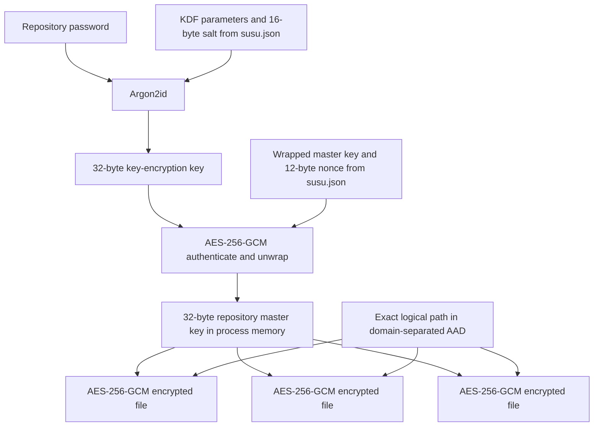

# Security

This document specifies the security behavior implemented by `susu`. It covers sensitive-file encryption, key and plaintext handling, repository and destination filesystem protections, failure behavior, and operational limits. For the general repository layout, path model, and command architecture, see [Design](design.md).

> `susu` has not undergone an independent security audit. Review the documented threat model and limitations before relying on it for high-value secrets.

The central security boundary is explicit:

- Files added with `--sensitive` are encrypted before `susu` stores them in the repository.
- Files added without `--sensitive` are intentionally stored as plaintext.
- Encryption authenticates each sensitive payload and its logical destination path; it does **not** authenticate the repository as a whole, the manifest as a whole, or public entries.
- Encrypted entries can remain confidential when the repository is copied or published, but public content and metadata remain disclosed, and `apply` still requires a trusted Git commit or another provenance check.

## Security goals

For entries marked `sensitive`, the implementation aims to:

1. keep plaintext out of `susu.json`, `encrypted/`, and other repository files created by the sensitive-add path;
2. protect repository-held plaintext against an attacker who obtains the repository, its Git history, or a backup but does not know the password;
3. authenticate the wrapped repository master key and every encrypted file before releasing plaintext;
4. bind each encrypted file to its exact portable logical path, preventing ciphertext for one path from authenticating at another path;
5. use a memory-hard password KDF and established authenticated-encryption primitives;
6. avoid persisting the password, password-derived key, or plaintext repository master key;
7. limit passwords, keys, and decrypted file buffers to the command invocation that needs them, with best-effort in-place zeroization;
8. confine managed source and destination operations beneath validated filesystem roots without following symlink components; and
9. use atomic per-file installation or replacement so ordinary write failures do not expose partially written final files.

Independently of entry sensitivity, the active private `susu` state directory, repository worktree, and Git common administrative directory are protected local control roots. `add` cannot capture exact, descendant, ancestor, canonical, physical, or case aliases of those roots, and opened-file identity checks additionally protect hard-linked local-state files. Applicable `apply` destinations cannot target any protected root. These goals concern `susu`'s own behavior. They do not make a compromised host, untrusted Git state, plaintext destination, or weak password safe.

## Assets and trust boundaries

| Asset | Security significance | Persisted by `susu`? |
| --- | --- | --- |
| Repository password | Unlocks the repository master key and enables offline verification of a password guess | No |
| Password-derived key-encryption key (KEK) | Wraps and unwraps the repository master key | No |
| 32-byte repository master key | Directly encrypts every sensitive file in that repository; compromise exposes all such files | Only as authenticated ciphertext in `susu.json` |
| Sensitive plaintext | The data being protected | Yes at the original source and after `apply`; not in sensitive repository storage |
| Encrypted files and crypto metadata | Non-secret cryptographic material, but essential recovery material and an offline password-guessing target | Yes |
| Manifest paths and policy | Reveals managed names, directory shape, sensitivity flags, and platform exclusions | Yes, in plaintext |
| Public entries | Intentionally unencrypted content | Yes, in plaintext |
| Local repository binding | Reveals the active repository's canonical local path | Yes, outside the repository; contains no key material |

The relevant trust boundaries are:

| Boundary | Implemented assumption or behavior |
| --- | --- |
| Git repository and remote | Untrusted for confidentiality: all sensitive content must remain encrypted there. Must be trusted separately for overall integrity before `apply`, because the manifest and public entries are not cryptographically authenticated by `susu`. |
| Git executable and environment | Trusted for worktree validation and lock placement. `git` is resolved through `PATH` and inherits variables such as `GIT_DIR`, `GIT_WORK_TREE`, and `GIT_COMMON_DIR`, which can redirect Git's interpretation of repository paths. |
| Local host, kernel, runtime, and binary | Trusted while a password, key, or plaintext is in use. A process with equivalent privileges can generally read or alter the same data. |
| `/dev/tty` | Trusted for no-echo password entry. A compromised terminal, keylogger, or TTY owner remains able to capture input. |
| `HOME` and `XDG_CONFIG_HOME` | Authorized plaintext roots. `apply` is expected to create usable plaintext files there, except beneath the runtime-specific protected control roots. |
| Local `susu` state directory | Protected control root containing the active binding, local lock, and state staging files. Its finite file identities are also protected from hard-linked `add` aliases. |
| Active repository worktree and Git common directory | Protected control roots containing portable snapshots, manifest state, Git metadata, locks, and staging files. Exact, descendant, ancestor, canonical, physical, and filesystem-resolved case aliases are rejected for `add` and applicable `apply`. Linked worktrees can have two disjoint protected roots. |
| Protected-root validation timing | Input/discovery overlaps fail before password processing. After an optional `add` password callback, every new candidate is rechecked before any candidate content or repository source is written; each source descriptor is checked again before its own read. `apply` checks after platform filtering, after source preflight, and immediately before each replacement. |
| Filesystem and random source | Expected to implement the requested Unix permission, descriptor, rename, link, sync, and cryptographic-randomness semantics correctly. |
| Git transport, signing, review, and history | Outside `susu`; Git and the operator remain responsible for them. |

## Attacker model

The primary confidentiality attacker can obtain all portable repository material, including:

- `susu.json`;
- every file under `public/` and `encrypted/`;
- current and historical Git objects;
- repository backups and mirrors; and
- filenames, sizes, timestamps, and commit history.

The attacker may make offline password guesses and may delete, corrupt, replace, or replay repository data. The attacker is assumed not to know a sufficiently strong repository password, not to control the host while it is unlocked, and not to subvert the operating system's cryptography or random source.

Under those assumptions:

- an encrypted file cannot be modified or moved to a different logical path without authentication failure, unless the attacker knows the repository master key;
- a wrong password cannot produce an unchecked master key or plaintext;
- repository possession permits offline password guessing but not direct recovery of the password or master key; and
- replaying an older valid encrypted file at the **same** logical path, or replaying an older coherent repository snapshot, is not detected.

Repository modification is not fully contained by file encryption. An attacker can alter unsigned manifest policy, remove entries, change platform exclusions, or provide attacker-chosen public entries. In particular, an untrusted manifest plus public source can direct `apply` to write attacker-controlled plaintext to representable locations within the permitted `HOME` or `XDG_CONFIG_HOME` roots, except the private `susu` state directory, active worktree, and Git common administrative directory. Applicable destinations already overlapping those roots are rejected before password prompting or repository-source access and are rechecked before mutation. Other local control files remain unprotected. Authenticate and review repository state before applying it.

## Explicit non-goals

`susu` does not provide:

- confidentiality for public entries or files that the user forgot to mark `--sensitive`;
- protection from malware, debuggers, keyloggers, same-user processes, a compromised binary, kernel, terminal, or hardware;
- confidentiality for original source files, applied destinations, backups or snapshots of those locations, or intentional `show` output;
- repository-wide signatures, a manifest MAC, public-file authentication, trusted-remote verification, or Git commit verification;
- a general name-based ignore or denylist for arbitrary control and staging paths; only the runtime-specific private state directory, active worktree, and Git common directory are protected roots;
- rollback, replay, deletion, or availability protection;
- metadata, filename, directory-shape, file-length, access-pattern, or timing privacy;
- automatic secret detection or validation that a file was classified correctly;
- secure deletion from filesystems, SSDs, snapshots, backups, remotes, or Git history;
- password-strength enforcement, online or offline guess throttling, password recovery, escrow, or multi-user access control;
- per-file keys, forward secrecy, compromise isolation between sensitive entries, or hardware-backed keys; or
- protection after the repository password or repository master key is compromised.

The implementation is not a sandbox for untrusted repositories and makes no claim of formal verification or independent cryptographic audit.

## Cryptographic construction

### Key hierarchy

There is one password-derived KEK and one random master key for a repository with initialized encryption. The password does not directly encrypt files.



Keys, salts, and AES-GCM nonces use Go's `crypto/rand` interface. Descriptor-relative source and destination staging names also use 12 random bytes from `crypto/rand`; manifest and local-state staging names are created exclusively with `os.CreateTemp`. Temporary names are not key material.

### Encryption initialization

`init` does not initialize encryption or request a password. Encryption is initialized lazily when `add --sensitive` has at least one new file and `susu.json` has no `crypto` object.

The production CLI then:

1. opens `/dev/tty` for input and output;
2. reads `Password:` with terminal echo disabled;
3. rejects an empty password;
4. reads `Confirm password:` the same way and requires an exact byte match;
5. generates a random 32-byte repository master key;
6. generates a random 16-byte Argon2id salt;
7. derives a 32-byte KEK with the parameters below;
8. generates a random 12-byte AES-GCM nonce;
9. encrypts and authenticates the master key under the KEK; and
10. keeps the resulting crypto metadata in the pending manifest while encrypting the new files.

The new encrypted sources are installed before the updated manifest is saved. On an ordinary pre-commit error, `susu` attempts to remove sources created by that `add`. A process crash or failed cleanup can leave an unreferenced source or staging file; sensitive source data remains encrypted.

### Unlock

For an existing encrypted repository, `susu`:

1. strictly loads and validates `susu.json`;
2. validates the crypto version, algorithms, lengths, and KDF safety bounds **before** invoking Argon2id;
3. reads the password once from `/dev/tty` without confirmation;
4. derives the KEK from the stored salt and parameters;
5. authenticates and decrypts the wrapped master key; and
6. requires the resulting key to be exactly 32 bytes.

A wrong password and an authenticated-encryption failure caused by a same-shape modification to the wrapped key are intentionally reported together: cryptography cannot distinguish them. Structurally malformed or unsupported metadata is reported separately and does not reach Argon2id.

### Exact algorithms and parameters

| Purpose | Implemented value |
| --- | --- |
| Password KDF | Argon2id (`argon2id`) |
| New-repository time cost | `3` passes |
| New-repository memory cost | `65536` KiB (64 MiB total) |
| New-repository parallelism | `4` lanes |
| KDF output | `32` bytes (256 bits) |
| KDF salt | `16` random bytes |
| Master key | `32` random bytes |
| Master-key wrapping | AES-256-GCM (`aes-256-gcm`) |
| Sensitive-file encryption | AES-256-GCM (`aes-256-gcm`) |
| GCM nonce | `12` random bytes for every wrapping or file-encryption operation |
| GCM tag | `16` bytes, appended to the ciphertext by the AEAD implementation |

Each sensitive file uses the repository master key directly as its AES-256 key. There is no per-file KDF or subkey.

The stored Argon2id parameters are used during unlock. The decoder accepts only parameters within these defensive bounds:

| Parameter | Accepted values |
| --- | --- |
| `time` | `1` through `10` |
| `parallelism` | `1` through `16` |
| `memory` | At least `8 × parallelism` KiB and at most `262144` KiB (256 MiB) |
| `keyLength` | Exactly `32` bytes |

These upper bounds limit malicious metadata but do not make KDF work free: an accepted manifest can still request substantially more work than a newly initialized repository.

### Domain separation and associated data

Master-key wrapping uses the exact ASCII/UTF-8 bytes:

```text
susu:repository-master-key:v1
```

Each sensitive file uses this exact associated-data construction:

```text
UTF-8("susu:sensitive-file:v1") || 0x00 || UTF-8(logicalPath)
```

For example, the logical path may be `~/.ssh/config` or `${XDG_CONFIG_HOME}/service/token`. The path is authenticated but not encrypted. It is not duplicated inside the encrypted-file envelope; the manifest supplies it during decryption.

The NUL separator and distinct prefixes separate master-key wrapping from file encryption and prevent ambiguous concatenation. The file AAD does **not** include a repository identifier, Git commit, source filename, platform exclusions, or monotonic counter. Consequently:

- ciphertext substitution between different logical paths fails;
- same-path replay succeeds if the replayed ciphertext is otherwise valid;
- whole-repository substitution or rollback is not detected; and
- manifest fields other than the logical path are not protected by the file's GCM tag.

### Nonce handling

Every call that wraps a master key or encrypts a file obtains a fresh random 96-bit nonce. Nonces are stored in plaintext with their ciphertext. `susu` does not keep a nonce registry or check repository history for prior values, so uniqueness is probabilistic rather than enforced. Security therefore depends on the random source avoiding nonce reuse under the same AES key.

## Versioned serialized formats

The serialized protocol has three distinct versioned contexts:

| Context | Field | Accepted value |
| --- | --- | --- |
| Repository manifest | top-level `susu.json.version` | `1` |
| Repository crypto metadata | `susu.json.crypto.version` | `1` |
| Per-file encrypted envelope | envelope `version` | `1` |

The crypto metadata and encrypted-envelope fields currently use the same numeric value and implementation constant, but they describe different serialized objects. Unknown manifest, crypto-metadata, encrypted-envelope, or algorithm values are rejected rather than guessed.

### `susu.json` crypto structure

The following is the exact field structure emitted for a representative sensitive entry; angle-bracketed strings describe variable Base64 values:

```json
{
  "version": 1,
  "entries": [
    {
      "path": "~/.secret",
      "source": "encrypted/.secret.enc",
      "sensitive": true
    }
  ],
  "crypto": {
    "version": 1,
    "kdf": {
      "algorithm": "argon2id",
      "parameters": {
        "time": 3,
        "memory": 65536,
        "parallelism": 4,
        "keyLength": 32
      },
      "salt": "<standard Base64 encoding of 16 bytes>"
    },
    "wrap": {
      "algorithm": "aes-256-gcm",
      "nonce": "<standard Base64 encoding of 12 bytes>",
      "ciphertext": "<standard Base64 encoding of 48 bytes>"
    }
  }
}
```

The wrapped ciphertext is exactly 48 decoded bytes: the 32-byte master key followed by a 16-byte GCM tag. Go's `encoding/json` represents every byte slice with the standard padded Base64 alphabet.

The `crypto` object is omitted until encryption is initialized. It can remain after the last sensitive entry is removed; `rm` does not erase or reset repository crypto metadata. A sensitive manifest entry without crypto metadata is invalid.

Manifest loading is bounded to 16 MiB and rejects malformed JSON, unknown fields at any represented level, unsupported versions, noncanonical paths, decoded Unicode control characters, U+2028/U+2029, duplicate managed paths or storage sources, and non-whitespace trailing data or additional JSON values. Validation runs after Go JSON decoding: invalid raw UTF-8 and invalid UTF-16 surrogate encodings may be replaced with U+FFFD, and Unicode format controls such as bidirectional overrides remain accepted. Known duplicate JSON object keys are not rejected separately; standard Go JSON decoding semantics apply. The manifest is serialized as indented JSON with sorted entries and a trailing newline, but whitespace and field order provide no security property. Human review tools should display untrusted path strings unambiguously rather than relying only on their rendered appearance.

### Encrypted-file envelope

Each file under `encrypted/` is compact JSON with this structure:

```json
{"version":1,"algorithm":"aes-256-gcm","nonce":"<standard Base64 encoding of 12 bytes>","ciphertext":"<standard Base64 encoding of plaintext plus 16-byte tag>"}
```

The `ciphertext` field contains the GCM output and tag together; there is no separate tag field. Empty plaintext is valid and produces 16 decoded ciphertext bytes.

Decryption rejects:

- empty input;
- malformed JSON;
- unknown fields;
- additional JSON values or non-whitespace trailing data;
- a missing or unsupported format version;
- a missing or unsupported algorithm;
- a nonce whose decoded length is not 12 bytes; and
- decoded ciphertext shorter than the 16-byte tag.

After structural validation, AES-GCM authentication must succeed with the repository master key and exact logical-path AAD.

## Command data flows and plaintext boundaries

| Command | Password behavior | Plaintext flow and persistence |
| --- | --- | --- |
| `init` | No prompt | Creates or validates repository metadata and local binding; moves no managed content. |
| public `add` | No prompt | Reads the source into memory and writes plaintext under `public/`. This is intentional. |
| sensitive `add` | One creation sequence or one unlock prompt | Reads each source into memory, encrypts it, and writes only the JSON envelope under `encrypted/`. The original source remains plaintext. |
| `list` | No prompt | Reads manifest metadata only; it does not read or decrypt file contents. |
| public `show` | No prompt | Streams the repository plaintext source to stdout. |
| sensitive `show` | One unlock prompt | Reads the envelope, authenticates and decrypts it in memory, then writes plaintext to stdout. It does not modify the destination or create a plaintext file. |
| `apply` with no applicable sensitive entry | No prompt | Streams public sources through same-directory staging files to destinations. |
| `apply` with applicable sensitive entries | One unlock prompt for the invocation | Authenticates and decrypts all applicable sensitive files in memory during preflight, then writes each through a same-directory plaintext staging file to its destination. |
| `rm` | No prompt | Removes the manifest entry and unlinks its repository source after the manifest transition; it does not decrypt or remove the destination. |

Platform exclusions are evaluated before deciding whether `apply` needs a password. After filtering, every applicable destination is checked against the private state directory, active worktree, and Git common directory. A destination already overlapping a protected root fails before repository-source access or password prompting. Destinations are checked again after source preflight and immediately before replacement. If every sensitive entry is excluded on the running platform, no unlock occurs.

### `show`

Sensitive `show` completes envelope parsing and GCM authentication before sending any plaintext to its output writer. A wrong password, malformed envelope, path mismatch, or authentication failure therefore produces no plaintext output. Once output begins, an output I/O failure can still leave a partial plaintext copy in a terminal, pipe, redirected file, or receiving process.

`show` deliberately makes stdout a plaintext boundary. Shell redirection, pipelines, terminal scrollback, session recording, and downstream programs are outside `susu`'s control.

### `apply` preflight and replacement

Before changing any destination, `apply`:

1. filters platform-excluded entries;
2. resolves every applicable logical destination and rejects canonical or physical overlap with the private state directory, active worktree, or Git common directory;
3. unlocks once if needed;
4. opens every applicable repository source as a regular file;
5. checks repository-source size limits;
6. fully authenticates and decrypts every applicable sensitive envelope;
7. rejects exact lexical duplicates and ancestor/descendant destination-string conflicts;
8. rechecks every applicable destination against the protected roots after source preflight; and
9. checks each destination once more immediately before its staging write.

This prevents a wrong password or corrupted sensitive source from causing a half-applied invocation. Public source content is not cryptographically authenticated.

Conflict comparison does not account for case-folding or Unicode-normalization aliases. On filesystems where different spellings identify the same object, aliased entries can pass preflight and be replaced sequentially.

After preflight, destinations are replaced in sorted order. Atomicity is per file, not across the command: a later permission, filesystem, or durability error can occur after earlier destinations were committed. The result reports paths whose final rename occurred.

For a sensitive destination, `apply`:

1. opens or creates the real parent path beneath the logical root without following child symlinks;
2. removes non-directory entries matching the reserved `.susu-apply-*.tmp` staging pattern in that parent;
3. creates an exclusive random `.susu-apply-<24 hex characters>.tmp` file in that directory;
4. sets the staging file's Unix mode to `0600`;
5. writes already-authenticated plaintext;
6. syncs and closes the file;
7. atomically renames it over the destination leaf; and
8. syncs the parent directory.

New parent directories requested for sensitive destinations use mode `0700`; existing parent permissions are not tightened. Unix mode bits do not override ACLs, privileged access, backups, snapshots, or other host-level mechanisms.

A destination leaf symlink is replaced as a directory entry rather than followed. A symlink in any component below the configured root is rejected. The configured `HOME` or XDG root itself may be a symlink; it is resolved once before a stable root descriptor is opened.

The staging file briefly contains plaintext. Ordinary errors remove it, but a crash, `SIGKILL`, or power loss can leave it behind. A later `apply` reaching the same parent removes matching stale entries without following them. The `.susu-apply-*.tmp` name pattern is therefore reserved: unrelated non-directory files matching it can also be removed by cleanup.

## Password, key, and plaintext lifetime

The production password provider reads from `/dev/tty` with echo disabled. It does not read an interactive password from stdin, place it in command-line arguments, or obtain it from an environment variable. If `/dev/tty` cannot be opened, the sensitive operation fails.

A command requests one password sequence at most:

- first encryption initialization requests a password and confirmation;
- a later sensitive `add` requests one password;
- sensitive `show` requests one password; and
- `apply` requests one password for all applicable sensitive files.

There is no password cache, daemon, agent, keychain integration, secret-service integration, or persisted unlocked key. Separate CLI invocations unlock independently.

The implementation explicitly overwrites these owned byte slices when their use ends:

- the password returned to application code;
- the password confirmation buffer;
- the Argon2id output KEK;
- the plaintext master key returned by initialization or unlock;
- plaintext buffers used by sensitive `add`, `show`, and `apply`; and
- serialized sensitive envelopes held after they are written during `add`.

Zeroization is best effort. Go is garbage-collected and does not guarantee elimination of compiler temporaries, copied slices, strings created by callers, cryptographic key schedules, Argon2 working memory, stack copies, core dumps, swap, or kernel and hardware copies. Memory is not locked with `mlock`. The host must therefore be trusted while secrets are in use.

## Filesystem confinement and atomic-write protections

The descriptor-relative safe-filesystem implementation is available on macOS and Linux. On other platforms these operations return an unsupported-platform error.

### Repository binding and storage paths

`init` resolves the supplied directory to a canonical absolute path, asks Git to treat it as the worktree root, resolves Git's canonical common administrative directory, and stores the worktree path in local state. The common-directory result is retained for both lock placement and protected-root policy during that repository object's lifetime. The Git subprocess inherits `PATH` and Git-related environment variables, so a trusted ordinary Git environment is required for this validation. Later opens reject a missing path, a path that now resolves through a symlink, a Git root mismatch, or missing storage directories. The binding is path-based: it does not detect a different valid worktree recreated or mounted at the same canonical path.

Repository source paths must be canonical relative paths beneath `public/` or `encrypted/`. Empty components, `.`, `..`, absolute paths, NUL bytes, prefix lookalikes, and escapes from the repository root are rejected. Manifest validation also requires each source to be the deterministic mapping of its logical path and sensitivity flag.

The top-level `public/` and `encrypted/` paths must be real directories, not symlinks. Source traversal then:

- resolves and opens the root directory;
- opens every child directory with descriptor-relative `openat`, `O_DIRECTORY`, and `O_NOFOLLOW`;
- opens the leaf with `O_NOFOLLOW` and `O_NONBLOCK`; and
- verifies through the opened descriptor that the leaf is a regular file.

The descriptor that was checked is the descriptor that is read. Stable parent-directory descriptors also prevent a pathname swap from redirecting a later create, link, rename, or remove outside the opened directory.

### `add` input handling

An explicitly supplied symlink or non-regular, non-directory object is rejected. While recursively walking a real directory, symlinks and non-regular objects are skipped rather than followed or read. Before walking, `add` rejects an input that is inside the private state directory, active worktree, or Git common directory, names one of those roots, or is an ancestor containing one. Canonical, physical, symlink, and filesystem-resolved case aliases are included, and these direct overlaps fail before a sensitive password prompt. A hard-linked protected state file inside an otherwise unrelated tree is rejected during discovery. After any required password callback, `add` reopens and validates every new candidate against all protected roots before reading any candidate content or writing any repository source. A protected substitution during password entry therefore fails command-wide rather than after an earlier candidate was processed. Before reading each selected file, `susu` reopens it beneath its `HOME` or XDG root with the same no-follow and regular-file checks, repeats repository-root validation, and compares the opened descriptor with protected state-file identities captured under the state lock. A later protected replacement fails before that candidate's content is read or stored. These checks reduce time-of-check/time-of-use exposure between discovery and reading.

Recursive collection still has no general name-based ignore list. The three protected runtime roots are always rejected, while unrelated staging or control locations are ordinary inputs unless another rule excludes them.

### New repository sources

A new source is never silently overwritten. `susu`:

1. opens or creates real parent directories beneath the repository root;
2. creates an exclusive random `.susu-add-*.tmp` regular file in the stable parent;
3. writes, syncs, and closes it;
4. atomically creates the final name as a hard link, which fails if the name already exists;
5. removes the temporary name; and
6. syncs the directory.

Sensitive sources are set to mode `0600`; public sources are normalized to `0644` or `0755` according to whether the input had any executable bit. Git does not preserve the full `0600` mode across clones, but the stored sensitive bytes remain ciphertext.

### Manifest and local state

`susu.json` is written as a mode-`0644` same-directory temporary file, synced, atomically renamed into place, and followed by a repository-directory sync. If the rename succeeds but directory sync fails, the operation reports that the manifest was committed with uncertain durability and does not roll back newly installed sources.

The local binding contains only the canonical repository path. Its directory is set to `0700`, its state and lock files to `0600`, and state replacement uses a synced same-directory temporary plus rename and directory sync. `init` requires the complete state directory to remain canonically and physically disjoint from both the active worktree and Git common directory, including filesystem-resolved case aliases. A symlink used as the state file is rejected on load. All three control roots are excluded from managed inputs and applicable destinations. A legacy manifest entry targeting one fails before unlock or source access when the overlap already exists; `list`, `show`, and `rm` remain available so the entry can be inspected and removed.

Source and destination content operations have the strongest descriptor-relative no-follow guarantees. Some top-level repository, manifest, and state setup or loading steps necessarily use pathname-based operating-system calls. Protected directory identities are captured and revalidated during `add` and `apply`, but an attacker able to rewrite filesystem namespaces concurrently as the same user remains outside the threat model.

Filesystem confinement prevents traversal outside validated roots, and overlap guards protect the private state directory, active worktree, and Git common directory. Other ordinary dotfiles and control files are not distinguished. The implementation does not recursively inventory repository or Git trees to discover every regular-file hard-link name. This does not permit `apply` to write through a repository hard link: destination replacement creates a new staging inode and renames it over only the outside directory entry. `add` can read an outside hard link to a repository file, but that repository inode and its existing contents already predate the operation; the finite local-state files receive stronger identity-based protection because capturing them would cross the machine-local binding boundary.

### Concurrency

Commands that use a repository hold:

- a local XDG-state lock; and
- an advisory `susu.lock` in Git's common administrative directory.

Both use exclusive `flock`. The Git-common-directory lock coordinates linked worktrees and separate local state homes that refer to the same repository. These locks coordinate cooperating `susu` processes only. Git commands and other processes do not honor them automatically, and lock acquisition has no timeout.

## Authentication and failure behavior

Security-sensitive failures are closed rather than downgraded:

| Condition | Behavior |
| --- | --- |
| Empty password | Rejected |
| Unsupported manifest or crypto format | Rejected before decryption |
| Unknown algorithm | Rejected |
| Missing, malformed, or excessive KDF parameters | Rejected before Argon2id |
| Wrong password | Master-key GCM authentication fails; no key is returned |
| Modified wrapped key with otherwise valid field sizes | Reported as an invalid password or modified wrapped metadata; no key is returned |
| Malformed or unknown encrypted-envelope fields | Rejected before GCM |
| Modified file nonce or ciphertext | GCM authentication fails; no plaintext is returned |
| Wrong repository master key | GCM authentication fails |
| Different logical path | AAD mismatch causes GCM authentication failure |
| Same-path older valid ciphertext | Accepted; no rollback state exists |
| Corrupt applicable sensitive source during `apply` | No destination is changed because sensitive authentication occurs during preflight |
| Destination failure after preflight | Earlier per-file replacements may remain committed; the failing staging file is removed on ordinary error |
| Directory sync failure after final rename | Reported as an error with the destination already replaced and durability uncertain |

Authentication establishes that a wrapped key or sensitive envelope was produced by a holder of the relevant key for the supplied AAD. It does not establish which Git commit should be trusted, whether a manifest entry should exist, whether platform policy is correct, or whether a public source is authentic.

## Resource limits and denial of service

| Input or operation | Implemented limit |
| --- | --- |
| Local state JSON | 64 KiB |
| `susu.json` | 16 MiB |
| Each filesystem input read by `add` | 512 MiB (`536870912` bytes) |
| Each repository source preflighted by `apply` | 1 GiB (`1073741824` bytes) |
| Sensitive repository source read by `show` | 1 GiB |
| Aggregate applicable sensitive plaintext retained by `apply` | 1 GiB |
| Accepted Argon2id memory | At most 256 MiB |
| Accepted Argon2id time | At most 10 passes |
| Accepted Argon2id parallelism | At most 16 lanes |

Important consequences and remaining denial-of-service exposure include:

- `add` buffers each input file in memory. Sensitive encryption additionally allocates ciphertext and Base64 JSON buffers.
- Sensitive `show` buffers the serialized envelope and plaintext. Sensitive `apply` retains all decrypted applicable plaintext until preflight completes or each file is committed.
- Public `apply` keeps validated source descriptors open and streams their bytes; public `show` streams without an explicit file-size cap.
- There is no explicit command-level limit on the number of input files, directory-walk entries, total public bytes, or aggregate bytes added. The 16 MiB manifest cap eventually bounds serialized entry metadata, not traversal work already performed.
- JSON/Base64 parsing and AEAD operations consume additional memory beyond the nominal file limits.
- A structurally accepted malicious manifest can request the maximum KDF cost once per sensitive invocation.
- An attacker can hold an advisory lock, provide slow filesystems or output consumers, or repeatedly invoke commands; no timeout or attempt-rate limiter is implemented.

These bounds reduce accidental or malicious resource consumption but do not provide availability against an attacker who controls repository data, the local account, or the underlying filesystem.

## Metadata leakage

Encryption does not hide:

- every logical path and deterministic repository source path;
- which entries are marked sensitive;
- platform exclusions;
- entry counts and directory shape;
- manifest, crypto, and encrypted-envelope format versions;
- KDF algorithm, work factors, salt, wrapping algorithm, wrapped key, and nonces;
- Git authorship, timing, branches, commit messages, and change history;
- additions, removals, and whether an encrypted file changed; or
- sensitive plaintext length.

For encrypted-envelope format version 1, the decoded `ciphertext` length is exactly `plaintext length + 16` bytes. Anyone who can read the envelope can therefore recover the exact plaintext byte length by Base64-decoding that field and subtracting the GCM tag length. JSON and filesystem overhead do not conceal it.

The salt, nonces, wrapped key, algorithms, and work factors are not secrets. Their disclosure is required for portable unlock and decryption. The wrapped key also gives an attacker a compact target for verifying offline password guesses without decrypting every file.

The local state file is not committed by `susu`, is kept outside the repository, and is mode `0600`, but it reveals the active checkout's local absolute path to processes that can read it. New `add` operations cannot capture the active private state directory, and `apply` cannot overwrite it. A legacy repository or its Git history may still contain state data captured before this protection was introduced.

## Git history, provenance, and rollback

`susu` validates that storage is a Git worktree root but does not run `git add`, commit, pull, push, merge, sign, verify, or rewrite-history operations.

Security consequences include:

- Sensitive `add` writes ciphertext to the current worktree, but it cannot remove plaintext already present in Git objects, reflogs, remotes, caches, forks, or backups.
- `rm` unlinks the current source and removes the manifest entry; it does not remove the destination, securely erase storage, clear crypto metadata, or rewrite Git history.
- Historical encrypted files normally remain decryptable by the same repository master key. Deletion from the current tree is not cryptographic erasure.
- A valid older envelope at the same logical path authenticates successfully.
- An older coherent `susu.json` plus matching sources can be applied successfully. There is no trusted counter, timestamp, commit hash, transparency log, or local remembered generation.
- Git checkout, merge, or conflict resolution can alter repository files while `susu` is not running or without honoring its advisory lock.
- Git signatures, protected branches, trusted remotes, review policy, and backup integrity can provide provenance, but only when configured and verified outside `susu`.

Do not use successful decryption as proof that the surrounding manifest or commit is the intended one.

## Recovery and rotation status

There is no password recovery, escrow key, recovery code, password-change command, KEK-rewrap command, or master-key rotation command.

Recovery therefore depends on preserving all of the following:

- the exact password bytes;
- `susu.json` with valid crypto metadata and the wrapped master key;
- each required encrypted envelope; and
- the logical path associated with each envelope.

Losing the password or wrapped-key metadata makes repository-only sensitive data unrecoverable. Losing one encrypted envelope loses that stored version unless another coherent copy exists in Git history or a backup. Plaintext that still exists at an original or applied destination is unaffected by loss of repository encryption material.

The repository master key is the compromise boundary. If it is disclosed, every current and historical sensitive envelope encrypted under it should be considered exposed. The implementation cannot rotate that key in place. Changing or migrating encryption material requires an external migration to separately initialized storage and careful handling of old Git history; hand-editing crypto fields does not constitute a supported rotation procedure.

## Operational guidance

1. **Use `--sensitive` before the first commit.** Classification is manual. Verify that the manifest entry has `"sensitive": true`, the source is under `encrypted/`, and no plaintext copy exists under `public/` or elsewhere in the repository.
2. **Use a strong, unique repository password.** Argon2id raises the cost of each guess but cannot compensate for a weak or reused password. Repository copies enable unlimited offline guessing.
3. **Authenticate repository state before `apply`.** Review the commit, manifest changes, public files, Git provenance, and every destination. Decryptable sensitive files do not make an untrusted manifest or public source safe. The private state directory, active worktree, and Git common directory are protected, but other control paths under HOME/XDG are not.
4. **Treat original and applied paths as plaintext storage.** Protect the account, permissions, ACLs, full-disk encryption, backups, snapshots, swap, and crash dumps according to the data's sensitivity.
5. **Use `show` deliberately.** Plaintext goes to stdout and may be captured by redirection, pipelines, terminal history or recording, logs in downstream tools, or shoulder surfing.
6. **Account for apply staging.** A sensitive `.susu-apply-*.tmp` file is mode `0600` but contains plaintext. After abnormal termination, inspect affected destination directories; a later `apply` removes matching stale entries. Do not use the reserved name pattern for unrelated files.
7. **Preserve coherent backups.** Back up `susu.json` and `encrypted/` together. A backup of ciphertext without its wrapped key metadata and logical paths is insufficient. Protect backups from deletion even though their sensitive contents are encrypted.
8. **Do not expect `rm` to erase data.** It leaves the local destination and cannot remove Git history, remote copies, snapshots, or storage remnants.
9. **Respond to accidental plaintext publication as a credential incident.** Remove or rewrite affected history where appropriate and rotate the exposed underlying credential; adding encryption afterward does not revoke disclosed data.
10. **Respond to key or password compromise by retiring the old encrypted history.** The implementation has no in-place rotation or revocation mechanism, and old repository copies remain usable by an attacker who obtained the relevant key material.
11. **Avoid concurrent external repository mutation.** Do not run checkout, merge, cleanup, or scripts that rewrite `susu.json`, `public/`, or `encrypted/` while a `susu` command is active.
12. **Scope recursive adds narrowly.** An input containing the private state directory, active worktree, or Git common directory is rejected. Still avoid broad ancestors containing unrelated staging files or other unprotected control data; there is no general automatic ignore list.
13. **Use a trusted Git execution environment.** Ensure `git` from `PATH` is the expected binary and unset repository-selection variables such as `GIT_DIR`, `GIT_WORK_TREE`, and `GIT_COMMON_DIR` unless their effect is explicitly intended.
14. **Account for filesystem aliases.** On case-insensitive or normalization-insensitive filesystems, visually different logical paths can resolve to the same destination and be applied sequentially.
15. **Do not hand-edit cryptographic metadata.** Unsupported versions, algorithms, lengths, or parameters fail closed, while accepted but inconsistent edits can make the repository permanently undecryptable.
